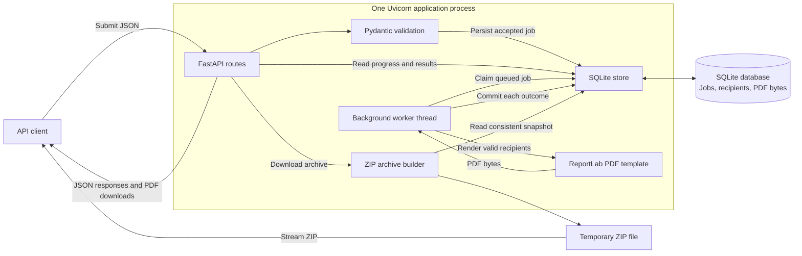
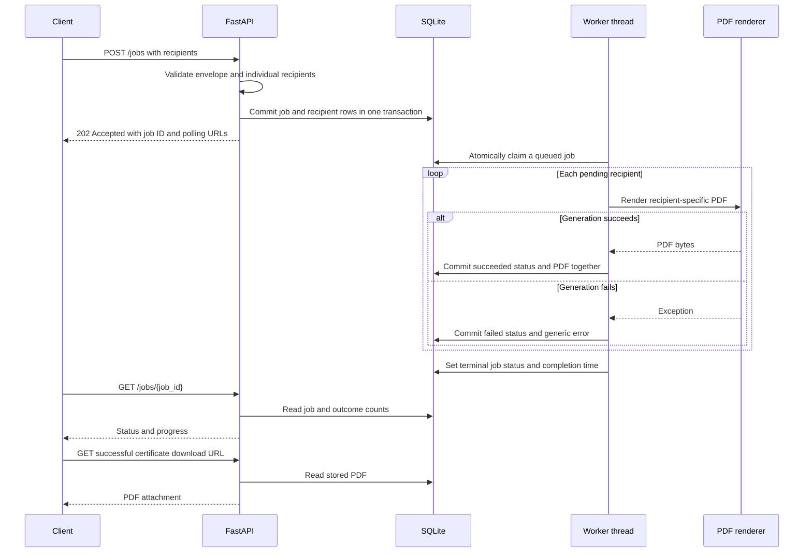
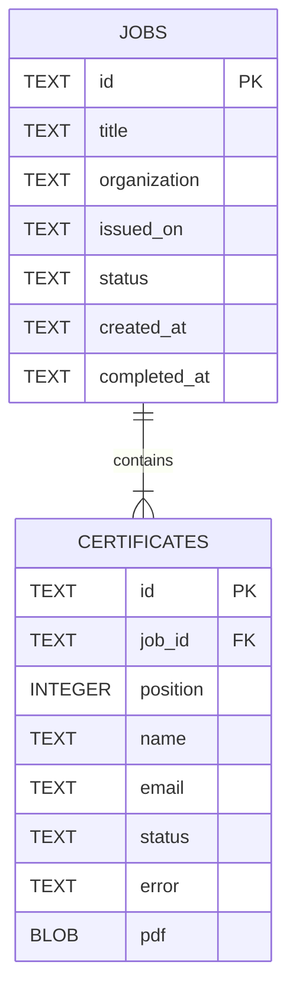
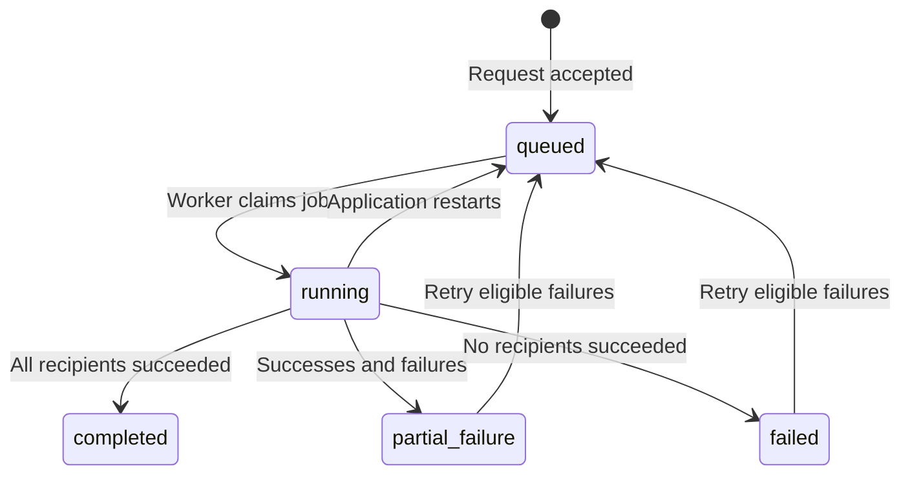

# Bulk Certificate Generator

A Python backend that generates certificates for up to **10,000 recipients in a single request**. Built with **FastAPI**, **SQLite**, and **ReportLab**, it processes jobs in the background, tracks individual outcomes, and provides PDF and ZIP downloads.

A failed recipient does not prevent other valid recipients from receiving certificates.

## Features

- Bulk submission with request and recipient validation.
- One predefined PDF template with recipient name, course/event title, organization, issue date, and certificate ID.
- Durable job queue with background processing and restart recovery.
- Job progress and paginated per-recipient results.
- Individual PDF downloads and bulk ZIP archives with a results manifest.
- Selective retry of generation failures, preserving successful certificates.
- Interactive API documentation and automated tests.

## System architecture



The API and worker share a database, not an in-memory queue. SQLite stores job metadata, recipient results, and generated PDFs. A dedicated thread polls for queued jobs every 250 milliseconds when idle and processes one job at a time. No Redis, Celery, or external storage service is required.

| Component | Responsibility | Implementation |
| --- | --- | --- |
| HTTP API | Accept jobs; expose progress, results, downloads, and retry | Routes in `create_app()` |
| Validation | Validate the request envelope and each recipient independently | `JobRequest`, `Recipient` |
| Persistence | Transactions, queue claims, relational integrity, and PDF storage | `Store`, SQLite |
| Background worker | Process queued jobs without waiting in the submission request | Thread started by application lifespan |
| Certificate renderer | Generate one PDF from the predefined template | `render_certificate()` |
| Archive builder | Package successful PDFs and all recipient outcomes | `/jobs/{job_id}/archive` |

### Request-to-certificate flow



### Relational data model



Each job has one certificate-result row per submitted recipient, including invalid recipients. `(job_id, position)` is unique and indexed; `position` preserves the original zero-based input order. Invalid recipients retain field errors and their position, with null name/email. All timestamps use UTC; `issued_on` is a calendar date.

### States and progress



| Job state | Meaning |
| --- | --- |
| `queued` | Persisted and waiting for the worker |
| `running` | Worker is processing pending recipients |
| `completed` | All certificates succeeded |
| `partial_failure` | At least one success and one failure |
| `failed` | No certificates succeeded |

Recipient states are `pending`, `succeeded`, and `failed`.

```text
processed = succeeded + failed
progress_percent = round(processed / total * 100, 2)
```

Validation failures count as processed immediately, so a queued job can have nonzero progress. Retrying generation failures resets those entries to pending, which can decrease progress.

## Getting started

### Requirements

- Python 3.11 or newer.
- Git and pip.
- Writable database and temporary-file directories.

### Install

```bash
git clone https://github.com/Sumanhm18/Bulk-Certificate-Generator.git
cd Bulk-Certificate-Generator
python3 -m venv .venv
source .venv/bin/activate
python -m pip install -r requirements.lock
python -m pip install -e '.[test]'
```

On Windows, activate the environment with `.venv\Scripts\Activate.ps1` in PowerShell instead.

`requirements.lock` records the dependency versions used during verification. For installation using the compatible version ranges instead, run `python -m pip install -e '.[test]'` without installing the lock file.

### Run

```bash
uvicorn app.asgi:app --host 127.0.0.1 --port 8000 --workers 1
```

- API: http://127.0.0.1:8000
- Swagger UI: http://127.0.0.1:8000/docs
- ReDoc: http://127.0.0.1:8000/redoc
- OpenAPI schema: http://127.0.0.1:8000/openapi.json

The database and tables are created automatically. **Run one application process per database**: startup recovery assumes exclusive ownership. Avoid `--reload` while generating jobs.

| Configuration | Default | Purpose |
| --- | --- | --- |
| `DATABASE_PATH` | `data/certificates.sqlite3` | SQLite database file |

Example with an alternative database location:

```bash
DATABASE_PATH=./data/demo.sqlite3 uvicorn app.asgi:app --workers 1
```

## API reference

| Method | Endpoint | Purpose | Successful response |
| --- | --- | --- | --- |
| `POST` | `/jobs` | Submit a bulk generation request | `202` JSON |
| `GET` | `/jobs/{job_id}` | Check status and progress | `200` JSON |
| `GET` | `/jobs/{job_id}/certificates` | Retrieve paginated recipient results | `200` JSON |
| `GET` | `/jobs/{job_id}/certificates/{certificate_id}` | Download one successful certificate | `200` PDF |
| `GET` | `/jobs/{job_id}/archive` | Download successful PDFs and a results manifest | `200` ZIP |
| `POST` | `/jobs/{job_id}/retry` | Requeue eligible generation failures | `202` JSON |

### 1. Submit a job

```bash
curl -X POST http://127.0.0.1:8000/jobs \
  -H 'Content-Type: application/json' \
  --data-binary @examples/request.json
```

Example request:

```json
{
  "title": "Python Fundamentals",
  "organization": "Learning Academy",
  "issued_on": "2026-10-07",
  "recipients": [
    {"name": "Ada Lovelace", "email": "ada@example.com"},
    {"name": "Grace Hopper", "email": "grace@example.com"},
    {"name": "", "email": "invalid-email"}
  ]
}
```

Illustrative acceptance response (IDs vary):

```json
{
  "id": "caa2b7af-1111-4444-8888-0123456789ab",
  "status": "queued",
  "status_url": "/jobs/caa2b7af-1111-4444-8888-0123456789ab",
  "results_url": "/jobs/caa2b7af-1111-4444-8888-0123456789ab/certificates"
}
```

`202 Accepted` confirms that the request was persisted, not that generation is complete. An all-invalid recipient list is still accepted and finishes as `failed` with individual validation errors.

### 2. Check progress

Replace the placeholder with the returned job ID:

```bash
JOB_ID=replace-with-returned-id
curl "http://127.0.0.1:8000/jobs/$JOB_ID"
```

The response includes job metadata, timestamps, status, `total`, `pending`, `processed`, `succeeded`, `failed`, and `progress_percent`. For the example request, the final state is `partial_failure`, with two successes, one failure, and 100% progress if both PDFs render successfully.

Poll every second until the job reaches a terminal state: `completed`, `partial_failure`, or `failed`.

### 3. Inspect recipient results

```bash
curl "http://127.0.0.1:8000/jobs/$JOB_ID/certificates?offset=0&limit=100"
```

The response contains `offset`, `limit`, and `items`. Each item includes `id`, `position`, `name`, `email`, `status`, `error`, and `download_url`. Successful entries have a download URL; other entries have null. Validation errors are stored as a JSON-encoded string of field/message objects; rendering failures have the generic string `Certificate generation failed`.

Pagination defaults to 100 entries, with a maximum `limit` of 1,000. Advance `offset` by `limit` until the returned page is shorter than `limit`.

### 4. Download one PDF

Use a successful entry's certificate ID or returned `download_url`:

```bash
CERTIFICATE_ID=replace-with-returned-certificate-id
curl -f "http://127.0.0.1:8000/jobs/$JOB_ID/certificates/$CERTIFICATE_ID" \
  -o certificate.pdf
```

The response uses `application/pdf` and an attachment filename based on the certificate UUID. Certificates are checked against the job ID in the URL.

### 5. Download all successful PDFs

After the job finishes:

```bash
curl -f "http://127.0.0.1:8000/jobs/$JOB_ID/archive" -o certificates.zip
```

The ZIP contains:

```text
certificates.zip
├── certificate-<uuid>.pdf
├── certificate-<uuid>.pdf
└── manifest.json
```

`manifest.json` includes job metadata and every recipient's ID, position, name/email, status, error, and PDF filename (null for failures). All-invalid jobs return a manifest-only archive.

Archives are built from a consistent database snapshot and streamed from a temporary disk file in 64 KiB chunks. One PDF at a time is loaded, plus manifest metadata. Temporary disk space must accommodate the archive.

### 6. Retry generation failures

After fixing a temporary rendering problem:

```bash
curl -X POST "http://127.0.0.1:8000/jobs/$JOB_ID/retry"
```

A `202` response includes the job ID, `queued` status, `retried` count, and status URL. The retry preserves job/certificate IDs and successful PDF bytes, clears the completion timestamp, and requeues only failed entries with validated recipient data. Invalid input needs correction in a new request.

Retries are manual; there is no retry history or automatic retry limit. A renderer can fail again. A write transaction prevents overlapping retry requests from requeuing the same job twice.

### Error responses

| Status | Condition |
| --- | --- |
| `404` | Job or certificate does not exist, or certificate belongs to another job |
| `409` | Certificate is pending/failed; archive job is active; retry job is active or has no eligible failures |
| `422` | Invalid request envelope or pagination parameters |

## Validation and failure handling

| Field | Rules |
| --- | --- |
| `title`, `organization` | Required strings; 1–160 characters before trimming; nonblank printable text supported by the PDF font |
| `issued_on` | Required date, normally supplied as `YYYY-MM-DD` |
| `recipients` | Required list of 1–10,000 objects |
| Recipient `name` | Required string; 1–120 characters before trimming; nonblank printable text supported by the PDF font |
| Recipient `email` | Required valid email syntax; DNS availability is not required |
| Unknown fields | Rejected at the envelope or recipient level |

The template uses built-in Latin fonts; text that cannot be encoded in Windows-1252 is explicitly rejected. Multilingual support would require embedded fonts and script shaping. Duplicate recipients are processed as separate input entries. Email is validated and returned in results; it is not printed on the certificate.

- **Envelope failure:** returns 422 without creating a job, including non-object recipient entries.
- **Recipient validation failure:** creates a failed result for that position; valid entries continue.
- **Rendering failure:** logs detailed exceptions on the server, stores a generic error, and continues with other recipients.
- **Process interruption:** startup requeues running jobs and processes only pending entries. Committed successful PDFs and failed results remain intact.
- **Systemic database failure:** the worker logs the error. Restart resumes interrupted work after the underlying issue is resolved.

## Design decisions and tradeoffs

| Decision | Reason | Tradeoff |
| --- | --- | --- |
| FastAPI and Pydantic | Typed validation and generated API documentation | Requires application-level policies for authentication and request size |
| SQLite with WAL and foreign keys | Relational integrity, durable storage, and simple local setup | Writes are serialized; this deployment uses one application process |
| Database-backed queue with one worker | Submission returns before rendering; no broker dependency | No distributed workers or leases; long jobs delay later jobs |
| Per-recipient commits | Failures are isolated and progress is visible during generation | More database transactions per job |
| PDF bytes stored as BLOBs | PDF and successful status commit atomically; simple backup | Database size grows with generated certificates |
| UUID-based IDs and filenames | Avoid user-controlled download paths and filename collisions | IDs do not provide access control |
| Paginated results | Avoid returning thousands of results and PDF bytes together | Clients must retrieve multiple pages |
| Disk-backed ZIP generation | Avoid holding the complete archive in memory | Uses temporary disk and holds a read snapshot while building |

Job creation and all recipient inserts happen in one transaction. Queue claiming and retry use `BEGIN IMMEDIATE`. Status/count reads use one database snapshot. The worker loads pending recipient metadata for one job, renders sequentially, and commits the PDF bytes and success status together.

## Tests and continuous integration

```bash
python -m pytest -q
```

The suite currently includes **16 tests** and uses isolated temporary databases. Coverage includes:

- Job acceptance and request validation.
- Individual invalid-recipient isolation.
- Generated PDF text and download headers.
- Progress before, during, and after processing.
- Individual renderer failure while other certificates succeed.
- Pagination, missing resources, and cross-job download checks.
- Background worker processing and restart recovery.
- ZIP contents, failure manifests, and manifest-only archives.
- Selective retries that preserve successful certificates.

The renderer is injectable, allowing tests to simulate failure without introducing test-only API fields. GitHub Actions is configured to run tests on Python 3.11 and 3.13 for pushes and pull requests.

## Project structure

```text
Bulk-Certificate-Generator/
├── app/
│   ├── __init__.py
│   ├── asgi.py                 # Runnable FastAPI app
│   └── main.py                 # Schemas, renderer, store, worker, API factory
├── tests/
│   └── test_api.py             # API, PDF, recovery, archive, and retry tests
├── examples/
│   └── request.json            # Ready-to-submit mixed-validity request
├── .github/workflows/
│   └── tests.yml               # Python test matrix
├── .gitignore
├── pyproject.toml              # Package metadata and compatible dependencies
├── requirements.lock           # Verified dependency versions
└── README.md
```

The `data/` directory is created at runtime and excluded from Git.

## Scope and future improvements

This is an assignment implementation designed to be easy to run, explain, and modify. It currently has no authentication, tenant isolation, global queue quota, HTTP body-size limit, retention policy, idempotent submission, or schema migrations. Repeated POST requests create separate jobs. Certificates and historical jobs remain stored until manually removed.

Before deploying as a shared service, add authorization, rate and body-size limits, retention, migrations, and monitoring. For multiple application processes or machines, move to a separate durable worker with leases and a database suited to that deployment; object storage would avoid keeping a large certificate archive in SQLite. Keep the current demo bound to localhost. ZIP manifests contain recipient personal information.

### Modifying the implementation

- **Change the certificate design:** edit `render_certificate()`.
- **Add recipient fields:** update `Recipient`, database schema, insert/read logic, and renderer.
- **Change processing behavior:** update `Store.process_one()` and the worker lifecycle.
- **Change storage:** replace the relevant `Store` operations and download/archive reads.

Existing databases require a migration when changing tables: `CREATE TABLE IF NOT EXISTS` does not update an existing schema.
